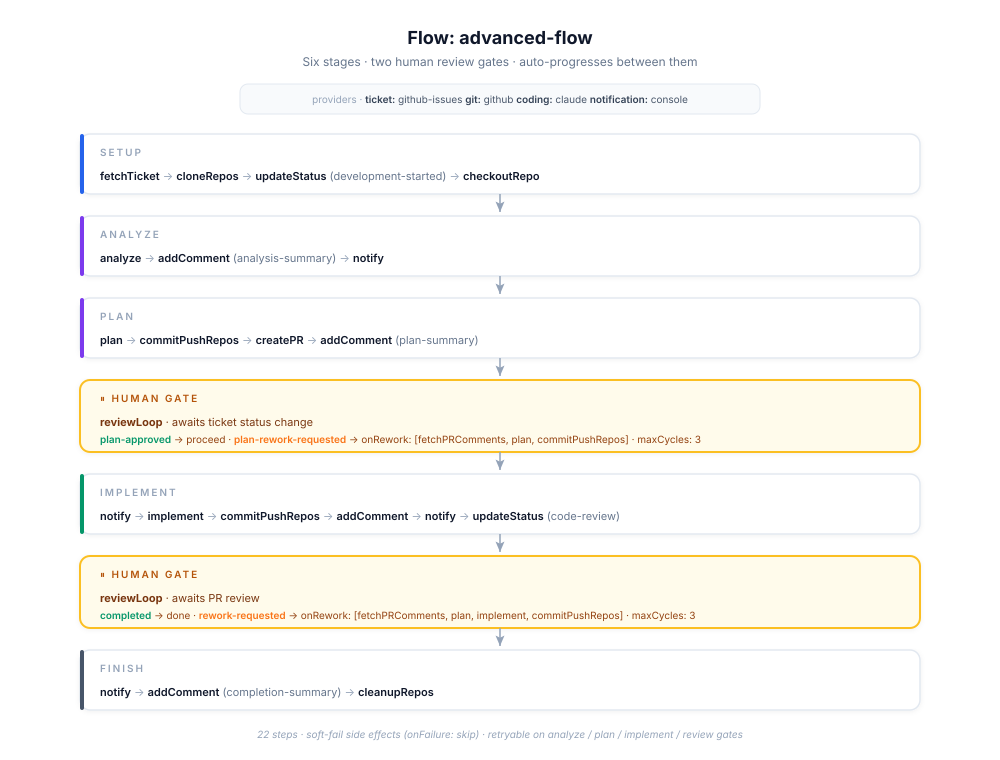

# Journeyman

Configurable, phase-based pipeline that automates **ticket → PR** by orchestrating pluggable adapters for AI coding CLIs, git hosting, issue trackers, and notification services.

Webhook-driven, per-product configurable. Ships with working adapters for **Claude**, **GitHub (repos + issues)**, and a growing set of stubs for Jira / Linear / GitLab / Slack / Monday / Gemini / Codex.

## What it does

You label an issue. An agent clones the repo, analyses the ticket, drafts a plan, writes the code, runs the tests, opens a PR, and pings you when it's ready for review. The orchestration is entirely driven by flow definitions built in the flow editor — the same flow works across products by swapping adapters.

## Repository layout

```
journeyman/
├── packages/
│   ├── core/                    @journeyman/core                   — interfaces + types only
│   ├── coding-cli/              @journeyman/coding-cli             — Claude / Gemini / Codex
│   ├── git-provider/            @journeyman/git-provider           — GitHub / GitLab REST
│   ├── github-api/              @journeyman/github-api             — shared GitHub Octokit client (REST + GraphQL)
│   ├── ticket-provider/         @journeyman/ticket-provider        — Jira / Linear / Monday / GitHub Issues / GitHub Projects
│   ├── notification-provider/   @journeyman/notification-provider  — Slack
│   ├── pipeline/                @journeyman/pipeline               — runner + phases + registries + CLI
│   └── pipeline-server/         @journeyman/pipeline-server        — Fastify + webhooks + management API
├── docs/                       All documentation
└── workspaces/                  Runtime state + logs + artifacts (one dir per product)
```

## Quick start

See [**Quickstart**](docs/quickstart.md) — minimum viable setup in ~10 minutes.

```bash
# 1. install deps
npm install

# 2. configure env — copy .env.example to .env and fill in:
#    - JOURNEYMAN_API_TOKEN, GITHUB_ACCESS_TOKEN
#    - JWT_SECRET   (generate with: openssl rand -hex 32)
#    - IDENTITY_ENFORCE=false   (keep dev fallback until credential vault lands)
cp .env.example .env

# 3. start Postgres + apply migrations
npm run infra:up
npm run migrate

# 4. start backend + worker + frontend (three terminals)
npm run start:api-server   # terminal 1 — Fastify API on :4000 (handles editor traffic, submits runs to Conductor)
npm run start:worker       # terminal 2 — polls Conductor for queued tasks and executes phase handlers
npm run dev:web            # terminal 3 — Vite dev server (web UI)
```

**All three are needed for end-to-end runs.** Without the worker, runs start in Conductor but stay queued — nothing actually executes. See [`@journeyman/orchestrator`](packages/orchestrator/README.md) for what the worker does and how to extend its phase handler coverage.

Open the web UI — on a fresh DB you'll see the **Setup wizard**. Create the first
organization and admin user, then sign in with those credentials.

Headless alternative — bootstrap from the CLI instead of the UI:

```bash
npx tsx packages/identity/src/cli/bootstrap.ts \
  --org "Cadmium" --slug cadmium \
  --username admin --password 'change-me' \
  --display-name 'Admin'
```

## Configuration

All runtime configuration is set via environment variables in `.env`. Copy `.env.example` to `.env` and fill in values.

The key worker variable is `JOURNEYMAN_BASE_DIR` — the root directory under which each run creates its own workspace subdirectory (e.g. `<JOURNEYMAN_BASE_DIR>/PROJ-123-2026-05-01T14-00-00Z/`). Falls back to `<os.tmpdir()>/journeyman-workspaces` when not set.

Flows and product/provider configuration are managed through the web UI and stored in the database.

### Path glossary

| Name | What it is | Example |
|---|---|---|
| `JOURNEYMAN_BASE_DIR` | Root under which all run workspaces are created. Set in `.env`. | `/workspaces` |
| `workspaceDir` | Per-run directory created by the `create-workspace` phase. | `/workspaces/PROJ-123-2026-05-01T14-00-00Z` |
| `repoDir` | Directory of a single cloned repository inside the workspace. | `/workspaces/PROJ-123-…/my-api` |
| `SKILLS_CACHE_DIR` | Root under which skill packages are cloned from git. Each package lives at `<dir>/<name>-<8-char-hash>/`. Falls back to `~/.journeyman/skills`. | `/data/skills-cache` |

## Commands

| Command | What it does |
|---|---|
| `npm install` | Install workspace dependencies |
| `npm run typecheck` | Typecheck all packages |
| `npm run infra:up` / `infra:down` / `infra:reset` | Start / stop / wipe local Postgres (docker-compose) |
| `npm run migrate` | Apply DB migrations from `@journeyman/migrations` |
| `npm run start:api-server` | Start the Fastify API server. Handles editor HTTP traffic; submits runs to Conductor but does **not** execute phases itself. |
| `npm run start:worker` | Start the orchestrator worker. Polls Conductor for queued tasks and runs the matching phase handler — this is what actually executes `analyze`, `checkout-repo`, etc. **Required for runs to make progress.** See [`@journeyman/orchestrator`](packages/orchestrator/README.md). |
| `npm run dev:web` | Vite dev server for the web UI |
| `npm run build:web` | Production build of the web UI |
| `npx tsx packages/identity/src/cli/bootstrap.ts ...` | Create the first org + admin (headless alternative to the setup wizard) |

## Documentation

### Getting started
- [**Quickstart**](docs/quickstart.md) — minimum viable setup in 10 minutes
- [**Setup**](docs/setup.md) — full installation + configuration guide
- [**Add a product**](docs/new-product.md) — add a new project to an existing instance

### Reference
- [Flows](docs/flows.md) — flow YAML authoring guide
- [Phases](docs/phases.md) — built-in phase catalog + writing custom phases
- [Products](docs/products.md) — adding and managing products
- [Triggers](docs/triggers.md) — webhook setup per source (GitHub, GitLab, Jira, API)
- [Management API](docs/management-api.md) — REST + SSE endpoints
- [Artifacts](docs/artifacts.md) — artifact model and storage

### Operations
- [Security](docs/security.md) — filesystem perms, secret rotation, redaction, encryption options
- [Troubleshooting](docs/troubleshooting.md) — known failure modes and fixes

### Package READMEs
- [`@journeyman/core`](packages/core/README.md) — interfaces + shared types
- [`@journeyman/coding-cli`](packages/coding-cli/README.md) — Claude / Gemini / Codex / OpenCode
- [`@journeyman/git-provider`](packages/git-provider/README.md) — GitHub / GitLab REST
- [`@journeyman/github-api`](packages/github-api/README.md) — shared Octokit client
- [`@journeyman/ticket-provider`](packages/ticket-provider/README.md) — Jira / Linear / Monday / GitHub Issues / GitHub Projects
- [`@journeyman/notification-provider`](packages/notification-provider/README.md) — Slack / Console
- [`@journeyman/pipeline`](packages/pipeline/README.md) — runner + phases + registries + CLI
- [`@journeyman/pipeline-server`](packages/pipeline-server/README.md) — Fastify + webhooks + management API
- [`@journeyman/ui`](packages/ui/README.md) — run visualizer (Vite + React)

## Architecture at a glance

### System architecture

Three layers: the server takes a request, the orchestrator runs the flow, and providers do the actual work. Every provider is pluggable.


**What to look at:**
- **Pipeline Server** (top) — HTTP entry point. Accepts webhooks and API triggers.
- **Pipeline Orchestrator** (middle) — runs the flow, executes phases, manages state and artifacts.
- **Providers row** (bottom) — four pluggable categories: Coding CLI, Git, Ticket, Notification. The dashed **"+ Your Provider"** slot is literal: implement the interface, register it, reference it by id.

### Orchestrator — how a run actually executes

A flow is a chain of steps. The runner walks them one at a time; each step produces one of four outcomes.


**What to look at:**
- **Flow** (top) — ordered list of steps from your YAML (`getTicket → analyze → plan → implement → createPR → …`).
- **Run the step** (middle) — the per-step mechanic: *resolve phase → execute → record outcome*. Timeout / retry / cancel are applied around the execute stage.
- **Outcome** (bottom) — four possibilities: `ok` advances the flow, `blocked` pauses for later resume, `retry` loops back with backoff, `failed` stops the run.
- **Threaded through every step** — `ctx.artifacts` (growing bag of outputs), `ctx.providers` (resolved adapters), `ctx.signal` (cancel/timeout), and persisted state.

### Adapter pattern

One interface in `@journeyman/core`, many implementations in adapter packages. Swap any provider by editing one line of YAML.


**What to look at:**
- **YAML line** (top) — `coding: claude` is the only input to the resolution.
- **Interface** (`ICodingCLI`) — the contract in `@journeyman/core`. Phase code only knows about this.
- **Implementations row** — Claude, OpenCode, Gemini, Codex all implement the same interface. The dashed **"+ Your Provider"** slot shows how to extend: implement the interface, register with an id.
- **Call site** — `ctx.providers.coding.analyze(…)` — phases never import a concrete provider. Swapping `claude` → `gemini` is genuinely a one-line YAML change.
- **Four categories** (bottom) — the same pattern applies to Coding / Git / Ticket / Notification.

### Sample flow

A real flow wired up end-to-end — six stages with two human review gates. This is an example of an end-to-end ticket → PR workflow with approval checkpoints, as seen in the flow editor.



**What to look at:**
- **Six stages** — Setup · Analyze · Plan · *(gate)* · Implement · *(gate)* · Finish. Each stage is a sequence of phases from the [catalog](docs/phases.md).
- **Two human gates** (amber) — `reviewLoop` steps that block the run until a reviewer changes the ticket status. On `*-approved` the pipeline advances; on `*-rework-requested` it re-runs the `onRework` sub-phases and blocks again.
- **Auto-recovery** — `retryable: true` on the heavy AI steps (`analyze`, `plan`, `implement`, review gates). Side effects (`addComment`, `notify`, `updateStatus`) are `onFailure: skip` so a failed notification never stops the run.

For more architectural detail, see the [spec](docs/superpowers/specs/2026-04-18-journeyman-pipeline-design.md) and the [phases catalog](docs/phases.md).

## Design principles

- **Interface-first.** Every provider category has an interface in `@journeyman/core`; implementations live in their own package. Swap Claude for Gemini, GitHub for GitLab, Jira for Linear — one line of YAML.
- **Declarative phase contracts.** Every phase declares `reads` / `writes` as static arrays; a boot-time validator walks each flow and proves artifact dependencies before anything runs.
- **Per-product isolation.** One dir per product under `workspaces/<productId>/` — state, logs, artifacts, ephemeral work. `rm -rf workspaces/<product>/` cleans up a whole tenant.
- **Webhook-routed products.** GitHub fires `/webhooks/github/edgereg`; the product id in the path drives flow selection, credential lookup, and workspace isolation.
- **Config-driven status transitions.** Semantic names (`development-started`, `code-review`) in flow YAML map to per-product literal values — one flow file, many tenants.

## Implementation status

| Component | Status |
|---|---|
| `@journeyman/skills` (add/remove packages, clone on create, pull latest, per-skill toggle, org promote) | ✅ |
| `ClaudeProvider` (analyze, plan, implement, clone, commit+push, cleanup) | ✅ |
| `GitHubProvider` (getRepo, createPR, listPRs) | ✅ |
| `GitHubIssuesProvider` (incl. label-based updateStatus) | ✅ |
| `@journeyman/pipeline` + `@journeyman/pipeline-server` | ✅ |
| `GitLabProvider` / `JiraProvider` / `LinearProvider` / `MondayProvider` | Stubs |
| `GeminiProvider` / `CodexProvider` | Stubs |
| `SlackProvider` | Stub |
| Human review loop auto-resume (via PR-comment webhook) | Stub |

## License

Private — internal tooling.
