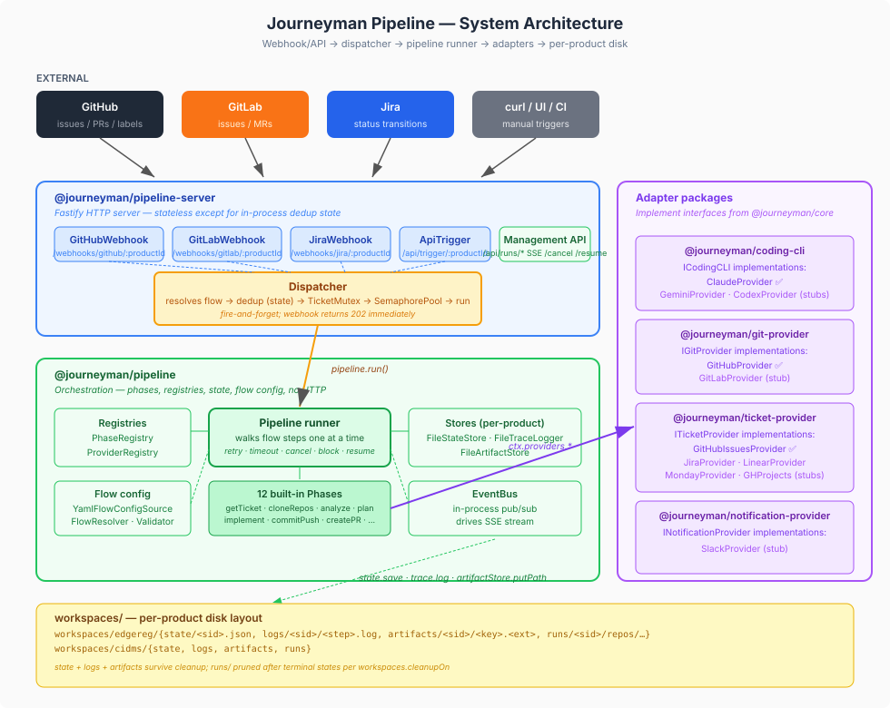
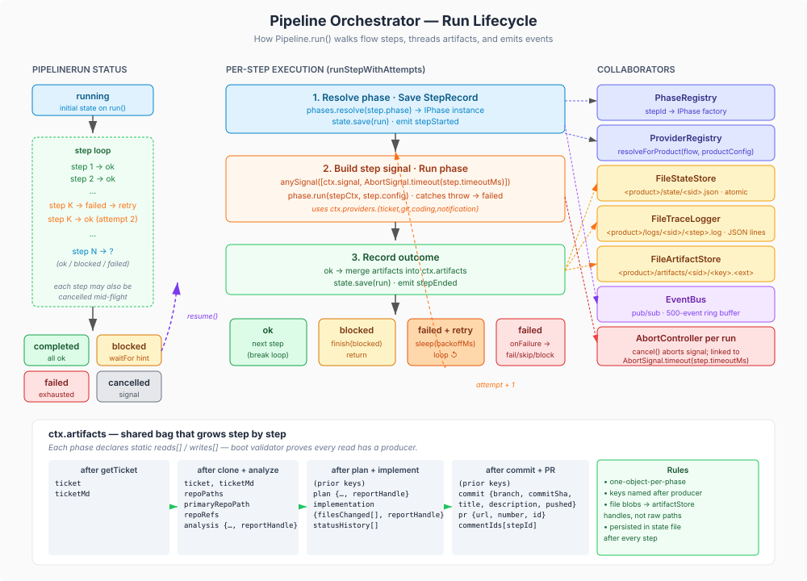
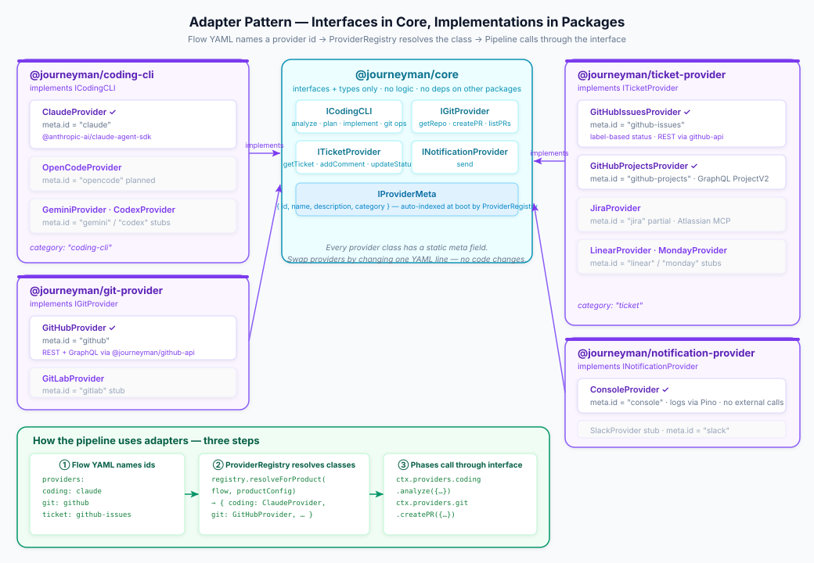

# Journeyman

Configurable, phase-based pipeline that automates **ticket → PR** by orchestrating pluggable adapters for AI coding CLIs, git hosting, issue trackers, and notification services.

Webhook-driven, per-product configurable. Ships with working adapters for **Claude**, **GitHub (repos + issues)**, and a growing set of stubs for Jira / Linear / GitLab / Slack / Monday / Gemini / Codex.

## What it does

You label an issue. An agent clones the repo, analyses the ticket, drafts a plan, writes the code, runs the tests, opens a PR, and pings you when it's ready for review. The orchestration is entirely driven by YAML flow definitions — the same flow works across products by swapping adapters.

## Repository layout

```
journeyman/
├── packages/
│   ├── core/                    @journeyman/core                   — interfaces + types only
│   ├── coding-cli/              @journeyman/coding-cli             — Claude / Gemini / Codex
│   ├── git-provider/            @journeyman/git-provider           — GitHub / GitLab REST
│   ├── github-mcp/              @journeyman/github-mcp             — shared GitHub MCP client
│   ├── ticket-provider/         @journeyman/ticket-provider        — Jira / Linear / Monday / GitHub Issues / GitHub Projects
│   ├── notification-provider/   @journeyman/notification-provider  — Slack
│   ├── pipeline/                @journeyman/pipeline               — runner + phases + registries + CLI
│   └── pipeline-server/         @journeyman/pipeline-server        — Fastify + webhooks + management API
├── docs/                       All documentation
├── config/                      Your pipeline.yaml + flows/
└── workspaces/                  Runtime state + logs + artifacts (one dir per product)
```

## Quick start

See [**Quickstart**](docs/quickstart.md) — minimum viable setup in ~10 minutes.

```bash
npm install
# create config/pipeline.yaml + config/flows/default.yaml  (see docs/setup.md)
# set env vars in .env or shell: JOURNEYMAN_API_TOKEN, GITHUB_ACCESS_TOKEN, ANTHROPIC_API_KEY
npx journeyman validate-config
npm start                        # or: npx journeyman serve
```

Or trigger a single run via CLI without the server:

```bash
npx journeyman run --product edgereg --ticket "edgereg-org/edgereg-api#42"
```

## Documentation

### Getting started
- [**Quickstart**](docs/quickstart.md) — minimum viable setup in 10 minutes
- [**Setup**](docs/setup.md) — full installation + configuration guide
- [**Add a product**](docs/new-product.md) — add a new project to an existing instance

### Reference
- [Configuration](docs/configuration.md) — `pipeline.yaml` field reference
- [Flows](docs/flows.md) — flow YAML authoring guide
- [Phases](docs/phases.md) — built-in phase catalog + writing custom phases
- [Products](docs/products.md) — adding and managing products
- [Triggers](docs/triggers.md) — webhook setup per source (GitHub, GitLab, Jira, API)
- [Management API](docs/management-api.md) — REST + SSE endpoints
- [Artifacts](docs/artifacts.md) — artifact model and storage

### Operations
- [Security](docs/security.md) — filesystem perms, secret rotation, redaction, encryption options
- [Troubleshooting](docs/troubleshooting.md) — known failure modes and fixes

### Package READMEs
- [`@journeyman/pipeline`](packages/pipeline/README.md)
- [`@journeyman/pipeline-server`](packages/pipeline-server/README.md)

## Architecture at a glance

### System architecture

How external triggers flow through the server into the pipeline into adapters and onto disk.



**What to look at:**
- **External layer** (top) — GitHub / GitLab / Jira webhooks and manual API calls are the only entry points.
- **`@journeyman/pipeline-server`** (blue) — Fastify app. Mounts one trigger source per enabled webhook + the `ApiTrigger` + the management API. Everything funnels through the **Dispatcher** (yellow), which is the only place that talks to the runner.
  - *Dispatcher* = resolves flow, does state-level dedup (`findActiveForTicket`), acquires the `TicketMutex` (in-process race protection), acquires the per-product `SemaphorePool` slot, then calls `pipeline.run()` fire-and-forget.
- **`@journeyman/pipeline`** (green) — the orchestrator. Phase/provider registries, flow config + validator, state/trace/artifact stores, event bus, and the `Pipeline` runner itself. No HTTP dependency — this package can be embedded in a CLI, a job, or a test harness.
- **Adapter packages** (purple) — each adapter package implements one interface from `@journeyman/core` with multiple concrete providers. The `ProviderRegistry` picks one per category based on the active flow's YAML.
- **Per-product disk** (yellow, bottom) — `workspaces/<productId>/` is the single dir for all of a product's runtime state. `rm -rf` it to wipe a whole tenant.

### Orchestrator — how a run actually executes

Zoomed in on `Pipeline.run()`: the step loop, retry/timeout/cancel/block branches, and how the shared artifact bag grows phase by phase.



**What to look at:**
- **Left column** — `PipelineRun.status` timeline. Starts `running`, walks steps, ends in one of four terminal states. A `blocked` run can be **resumed** (dashed purple arrow) via `POST /api/runs/:id/resume`; resume uses the frozen `flowSnapshot` on the run, not current config.
- **Center column** — the three-stage per-step execution: (1) resolve phase + save record + emit `stepStarted`, (2) build a step-scoped `AbortSignal` with optional timeout and run the phase, (3) record outcome and save. On `failed` + attempts remaining, retry loops back to stage 2 (orange arrow).
- **Right column** — collaborators the runner touches per step: registries (resolve phase class), stores (persist state, trace lines, artifacts), event bus (publish `stepStarted`/`stepEnded`/`logLine`), and the run's `AbortController` (cancel source).
- **Artifact bag panel** (bottom) — the growing `ctx.artifacts` map. Each phase writes one top-level key named after what it produced. File blobs become `ArtifactHandle`s, stored in `FileArtifactStore` (survives `cleanup` phase — state references handles, not paths into the ephemeral clone).

### Adapter pattern

How the interface-first design lets you swap Claude for Gemini or GitHub Issues for Jira by editing one line of YAML.



**What to look at:**
- **Center (blue)** — `@journeyman/core` holds the four interfaces (`ICodingCLI`, `IGitProvider`, `ITicketProvider`, `INotificationProvider`) plus `IProviderMeta`. No logic lives here; just contracts.
- **Purple panels** — each adapter package implements one interface. Every provider class exposes a **static `meta`** field with `{ id, name, description, category }`; the `ProviderRegistry` auto-indexes them at boot.
- **Three-step resolution (bottom, green)**:
  1. Flow YAML names provider ids: `coding: claude, git: github, ticket: github-issues, …`
  2. `ProviderRegistry.resolveForProduct(flow, productConfig)` looks those ids up per category and instantiates the classes, passing per-product options (`providerConfig.git.tokenEnv`, etc.).
  3. Phases call everything through the interface on `ctx.providers.*` — they never import a concrete class. Swapping `claude` → `gemini` in the flow is a one-line change and no phase code moves.

For more architectural detail, see the [spec](docs/superpowers/specs/2026-04-18-journeyman-pipeline-design.md) and the [phases catalog](docs/phases.md).

## Design principles

- **Interface-first.** Every provider category has an interface in `@journeyman/core`; implementations live in their own package. Swap Claude for Gemini, GitHub for GitLab, Jira for Linear — one line of YAML.
- **Declarative phase contracts.** Every phase declares `reads` / `writes` as static arrays; a boot-time validator walks each flow and proves artifact dependencies before anything runs.
- **Per-product isolation.** One dir per product under `workspaces/<productId>/` — state, logs, artifacts, ephemeral work. `rm -rf workspaces/<product>/` cleans up a whole tenant.
- **Webhook-routed products.** GitHub fires `/webhooks/github/edgereg`; the product id in the path drives flow selection, credential lookup, and workspace isolation.
- **Config-driven status transitions.** Semantic names (`development-started`, `code-review`) in flow YAML map to per-product literal values — one flow file, many tenants.

## Implementation status

| Component | Status |
|---|---|
| `ClaudeProvider` (analyze, plan, implement, clone, commit+push, cleanup) | ✅ |
| `GitHubProvider` (getRepo, createPR, listPRs) | ✅ |
| `GitHubIssuesProvider` (incl. label-based updateStatus) | ✅ |
| `@journeyman/pipeline` + `@journeyman/pipeline-server` | ✅ |
| `GitLabProvider` / `JiraProvider` / `LinearProvider` / `MondayProvider` | Stubs |
| `GeminiProvider` / `CodexProvider` | Stubs |
| `SlackProvider` | Stub |
| Human review loop auto-resume (via PR-comment webhook) | Stub |

## License

Private — internal tooling.
