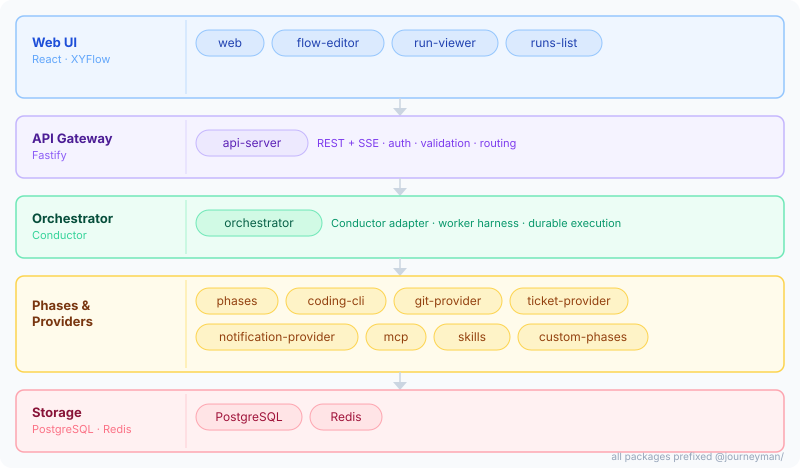

# Journeyman

Configurable, phase-based AI pipeline that automates ticket → code → PR workflows.

  

## What is Journeyman?

Journeyman watches for tickets (Jira, Linear, GitHub Issues, Monday) and runs configurable AI-powered flows that clone repos, analyze the ticket, write code, and open PRs — all without manual intervention. A visual, n8n-style canvas editor lets you drag-and-drop phase nodes, wire conditional branches, and configure retry policies without touching code. The provider pattern means you can swap any AI coding tool (Claude, Gemini, Codex), git host (GitHub, GitLab), ticket tracker, or notification channel without changing your flow definitions. Durable execution is backed by Conductor, with support for step retries and human-in-the-loop pause/resume gates.

## Architecture



| Layer | Role |
|---|---|
| **Web UI** | Visual canvas editor, live run monitoring, runs history |
| **API Gateway** | Fastify REST + SSE; auth, validation, routing |
| **Orchestrator** | Conductor adapter, worker harness, durable execution |
| **Phases & Providers** | Execution logic per flow node — AI coding, git, tickets, notifications |
| **Storage** | PostgreSQL (persistence) + Redis (job queue) |

## Packages

### Shared

| Package | Description |
|---|---|
| `@journeyman/core` | Interfaces and types — the contract all packages depend on |

### UI

| Package | Description |
|---|---|
| `@journeyman/web` | React web shell (flows list, flow editor page, run detail page) |
| `@journeyman/flow-editor` | Visual canvas editor component (drag-drop nodes, properties panel, MCP/skills config) |
| `@journeyman/run-viewer` | Read-only execution canvas with live per-node status |
| `@journeyman/runs-list` | Sortable, filterable run history table |

### Backend

| Package | Description |
|---|---|
| `@journeyman/api-server` | Fastify HTTP gateway with REST and SSE endpoints |
| `@journeyman/orchestrator` | Conductor adapter, worker harness, pluggable flow and run stores |
| `@journeyman/identity` | JWT auth, bcrypt passwords, user/org/role management |
| `@journeyman/secrets` | User- and org-scoped secret vault with AES encryption |
| `@journeyman/migrations` | SQL migrations (`journeyman-migrate` CLI) |

### Phases

| Package | Description |
|---|---|
| `@journeyman/phases` | Built-in phase catalog (getTicket, analyze, plan, implement, createPR, …) |
| `@journeyman/custom-phases` | User-defined AI phase registration with prompt templates |

### Providers

| Package | Description |
|---|---|
| `@journeyman/coding-cli` | AI coding operations via Claude Agent SDK (analyze, plan, implement, git) |
| `@journeyman/coding-models` | AI model provider configuration (Claude, Gemini, Codex) |
| `@journeyman/git-provider` | GitHub and GitLab REST (create PRs, MRs, list repos) |
| `@journeyman/github-api` | Shared Octokit client (REST + GraphQL, retry + throttling) |
| `@journeyman/ticket-provider` | Jira, Linear, Monday, GitHub Issues and Projects |
| `@journeyman/notification-provider` | Slack notifications |

### Integrations

| Package | Description |
|---|---|
| `@journeyman/mcp` | MCP instance registry, resolver, and Claude Agent SDK adapter |
| `@journeyman/skills` | Skill package management and Claude Agent SDK adapter |

## Getting Started

```bash
# 1. Install dependencies
npm install

# 2. Start infrastructure (Postgres, Redis, Conductor)
npm run infra:up

# 3. Run database migrations
npm run migrate

# 4. Copy and fill environment variables
cp .env.example .env

# 5. Start API server, worker, and web UI
npm run start:api-server
npm run start:worker
npm run dev:web
```

→ [Quickstart guide](docs/quickstart.md) — 10-minute end-to-end walkthrough

→ [Full setup reference](docs/setup.md) — all environment variables, webhook config, deployment

## Flow Editor

The visual canvas is powered by `@journeyman/flow-editor`, a React component built on XYFlow. Nodes represent phases (built-in or custom); edges carry JSON Logic conditions for conditional branching between them. The properties panel lets you configure node inputs, retry/backoff policy, MCP tools, skill packages, and secret bindings per node. Flows can be authored in the UI, validated, and published — the same JSON schema is used by the orchestrator at runtime.

→ [Flow authoring guide](docs/flows.md)

## Docs

### Using Journeyman

| Doc | Description |
|---|---|
| [Quickstart](docs/quickstart.md) | 10-minute end-to-end: install, configure, trigger your first run |
| [Setup](docs/setup.md) | Full install reference: env vars, webhook config, deployment |
| [Products](docs/products.md) | Logical tenants — isolate flows, repos, and concurrency per team |
| [New Product](docs/new-product.md) | Add a new product via the UI without touching code |
| [Flows](docs/flows.md) | Author flows in the visual editor or YAML: nodes, edges, conditions, retries |
| [Phases](docs/phases.md) | Built-in phase catalog and the `IPhaseHandler` interface |
| [Custom Phases](docs/custom-phases.md) | Register user-defined AI phases with custom prompts and tools |
| [Providers](docs/providers.md) | Configure coding, git, ticket, and notification providers |
| [Triggers](docs/triggers.md) | API, GitHub, GitLab, and Jira webhook trigger sources |
| [Artifacts](docs/artifacts.md) | Shared artifact bag: how data flows between steps |
| [Management API](docs/management-api.md) | Full REST + SSE API reference |

### Platform Features

| Doc | Description |
|---|---|
| [MCP](docs/mcp.md) | Connect Model Context Protocol servers to flows and AI phases |
| [Skills](docs/skills.md) | Enable reusable skill bundles for AI phases |
| [Secrets](docs/secrets.md) | User- and org-scoped secret vault with flow bindings |
| [Users & Roles](docs/users.md) | Authentication, user management, and role-based access |
| [Webhooks](docs/webhooks.md) | Inbound webhook verification, HMAC signing, and dedup |

### Operations

| Doc | Description |
|---|---|
| [Security](docs/security.md) | Threat model, token management, secret rotation, encryption |
| [Troubleshooting](docs/troubleshooting.md) | Runbook for common failure modes |

## Development

```bash
# Type-check all packages
npm run typecheck

# Check import boundaries
npm run check:boundaries

# Run tests
npm test

# Infrastructure lifecycle
npm run infra:up      # start Postgres, Redis, Conductor
npm run infra:down    # stop containers
npm run infra:reset   # wipe volumes and restart
```

## Deployment

Journeyman ships two deployment paths sharing one `Dockerfile`:

- **Docker Compose** — full stack on one host. `npm run compose:up` builds the four runtime images (`api-server`, `worker`, `web`, `migrations`) and starts everything including Postgres, Redis, and Conductor. The web UI is at <http://localhost:8081>.
- **Kubernetes (any conforming cluster)** — Kustomize manifests in [`deploy/k8s/`](deploy/k8s/). `npm run k8s:up` builds images and applies the `local` overlay. See [`deploy/k8s/README.md`](deploy/k8s/README.md) for how to load locally-built images into kind/minikube and how to adapt the `example-registry/` overlay for remote registries.

Design and specification: [`docs/superpowers/specs/2026-05-19-deployment-design.md`](docs/superpowers/specs/2026-05-19-deployment-design.md).
