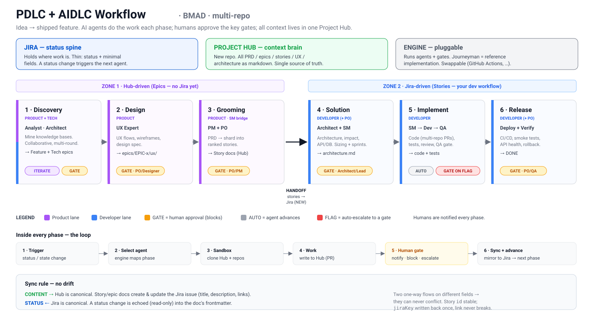

# BMAD Framework — PDLC + AIDLC Workflow

A standard way to take an idea from **discovery → shipped feature**, across multiple
repos, using AI agents at every phase and humans at the key gates.

This folder is the **shareable home** for the workflow: the diagram to send teammates,
the setup guide, and a pointer to the full design spec.

---

## The one-picture version

> If the SVG doesn't render in your viewer, open [`workflow-diagram.svg`](./workflow-diagram.svg) directly.

## How it works in 60 seconds

- **Jira = status spine.** It holds *where* a piece of work is, with minimal fields. A
  status change is what triggers the next AI agent.
- **Project Hub = context brain.** A dedicated repo that holds *all* the content — PRDs,
  epics, stories, UX/design, architecture — as plain markdown. The single source of truth.
- **Engine = pluggable.** It runs the agents and the gates. **Journeyman** is the
  reference engine; you could swap in GitHub Actions or another runner.
- **BMAD = the agents.** Each phase uses BMAD's roles (Analyst, PM, PO, UX, Architect,
  SM, Dev, QA) and its templates/checklists, copied into the Hub's `process/` folder.
- **Humans stay in control.** Notified every phase; they must approve the big gates;
  anything an agent flags auto-escalates to a human.

## Two zones, six phases

| Zone | Phases | Tracked in |
|---|---|---|
| **Zone 1 — Hub-driven** | Discovery → Design → Grooming | the Hub (no Jira yet) |
| **Zone 2 — Jira-driven** | Solution → Implementation → Release | Jira (your dev workflow) |

The handoff is **Grooming**: approved stories are mirrored from the Hub into Jira and
enter the dev workflow.

## Two lanes

- **🟣 Product lane** (Analyst, PM, PO, UX) — decides *what* and *why*.
- **🔵 Developer lane** (Architect, SM, Dev, QA) — decides *how* and *whether it's sound*.
- **Bridges:** SM (product → dev-ready), PO (in the loop at every gate).

## What's in this folder

| File | What it's for |
|---|---|
| [`workflow-diagram.svg`](./workflow-diagram.svg) | The shareable, one-page diagram |
| [`SETUP.md`](./SETUP.md) | Step-by-step guide to stand the workflow up |
| `README.md` | This overview |

## Full design

The complete design (architecture, sync contract, status→agent mapping, BMAD adoption,
edge cases, testing) lives in the spec:

→ [`../docs/superpowers/specs/2026-06-21-pdlc-aidlc-workflow-design.md`](../docs/superpowers/specs/2026-06-21-pdlc-aidlc-workflow-design.md)

## Getting started

Read this README → skim the diagram → follow [`SETUP.md`](./SETUP.md) step by step →
dry-run one epic end to end before rolling out to the team.
