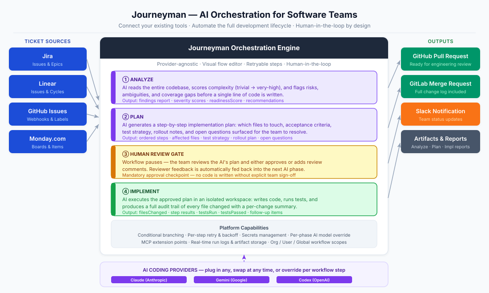
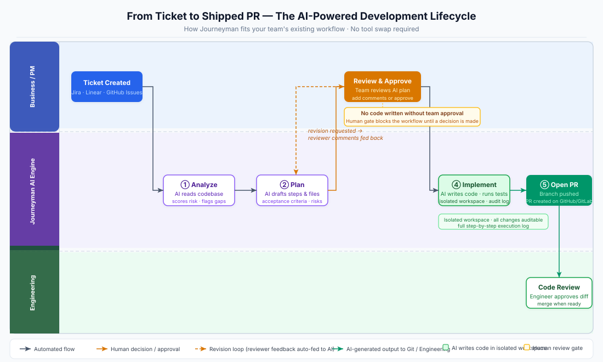

# Journeyman — Business Overview Slides

Two slides for presenting Journeyman to business and product teams.

---

## Slide 1 — What is Journeyman?



### Journeyman: AI Orchestration for Software Teams

Journeyman is a provider-agnostic orchestration platform that connects your existing tools — AI coding assistants, git hosts, ticket trackers, and notification services — into automated, repeatable workflows.

### Core Capabilities

| Capability | What it does |
|---|---|
| **AI Operations** | Automatically analyzes codebases, generates implementation plans, and writes code via Claude, Gemini, or Codex |
| **Git Automation** | Clones repos, commits changes, pushes branches, and manages isolated workspaces per issue |
| **Workflow Orchestration** | Visual, node-based flows with conditional branching, retry policies, and human-approval gates |
| **Tool Integrations** | Plug-and-play with GitHub/GitLab, Jira/Linear/Monday, and Slack — swap providers without rewriting workflows |

### The Four Phases

1. **Analyze** — AI reads the entire codebase, scores complexity, and flags risks, ambiguities, and coverage gaps before a line is written.
2. **Plan** — AI generates a step-by-step implementation plan with affected files, acceptance criteria, test strategy, and rollout notes.
3. **Human Review Gate** — Workflow pauses. Team reviews the AI's plan and approves or adds comments. Reviewer feedback is automatically fed into the next AI phase.
4. **Implement** — AI executes the approved plan in an isolated workspace: writes code, runs tests, and produces a full audit trail.

### Trigger → Run → Ship, automatically.

Webhooks from GitHub, GitLab, or Jira fire Journeyman workflows the moment a ticket is created or a status changes.

---

## Slide 2 — Improving the Product Development Lifecycle



### From Ticket to Pull Request — Without Manual Handoffs

```
Business / PM     │  Ticket Created  ──────────────────────►  Review & Approve
                  │         │                                        │
──────────────────┼─────────┼────────────────────────────────────────┼──────────
                  │         ▼                                        │
Journeyman AI     │    ① Analyze  ──►  ② Plan  ──►  [gate]  ──►  ④ Implement  ──►  ⑤ Open PR
                  │                              ◄── (revision loop)                      │
──────────────────┼──────────────────────────────────────────────────────────────────────┼──
                  │                                                                       ▼
Engineering       │                                                               Code Review
```

### Where Journeyman Accelerates the PDLC

| Stage | Before Journeyman | With Journeyman |
|---|---|---|
| **Triage & Scoping** | Engineers estimate manually | AI scores complexity (`trivial` → `very-high`) and surfaces risks automatically |
| **Planning** | Ad-hoc, undocumented | Structured plan with ordered steps, acceptance criteria, and rollout notes — stored as artifacts |
| **Implementation** | Developer context-switches to start | AI runs implementation in an isolated workspace; engineer reviews the diff |
| **Review** | Back-and-forth across Slack/Jira/GitHub | Reviewer feedback fed directly back into the next AI run via `reviewComments` |
| **Visibility** | Status scattered across tools | Real-time step events and logs surfaced in a single run-viewer UI |

### Key Guardrails for Business Confidence

- **Human-task gates** enforce mandatory approval before code is committed — nothing ships without sign-off.
- **Per-step retry policies** with configurable backoff prevent silent failures.
- **Structured, auditable findings** — AI outputs (risks, ambiguities, coverage gaps) are typed and stored, not buried in chat logs.
- **Isolated workspaces** per issue mean AI work never touches your main branch until a PR is opened.

---

*Diagrams: [slide-1-platform-overview.svg](diagrams/slide-1-platform-overview.svg) · [slide-2-pdlc-swimlane.svg](diagrams/slide-2-pdlc-swimlane.svg)*
