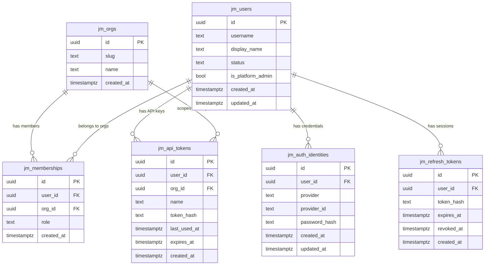
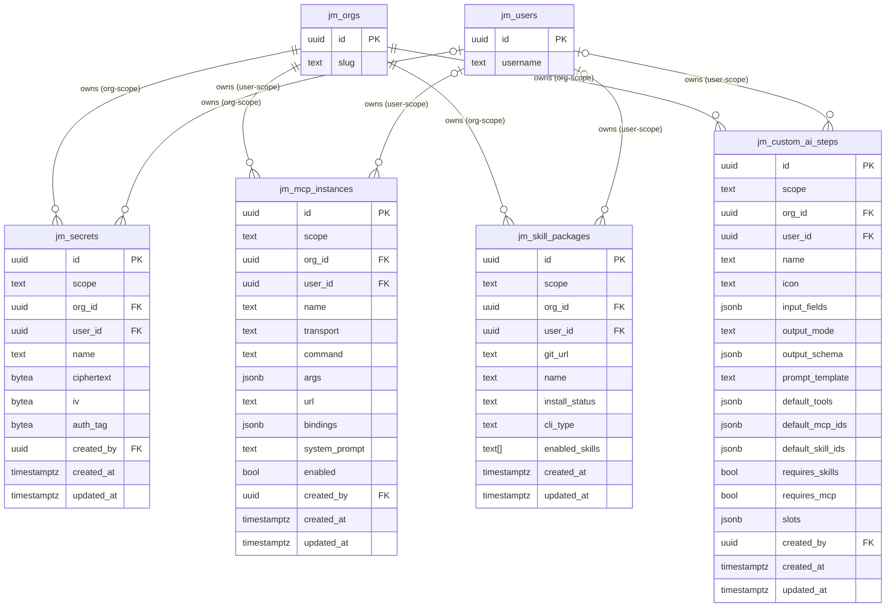
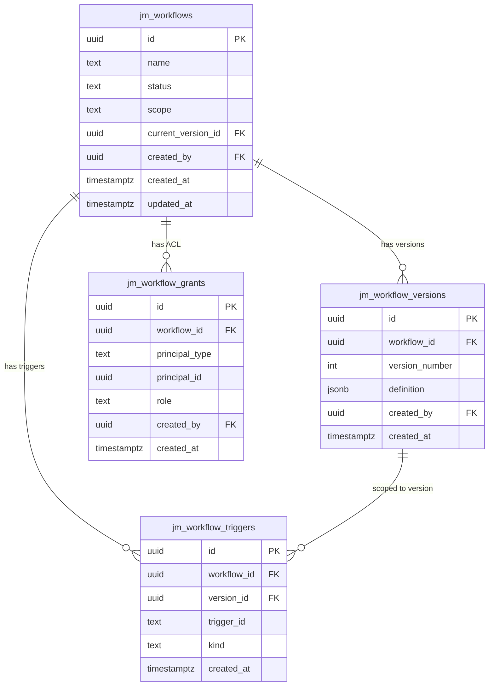
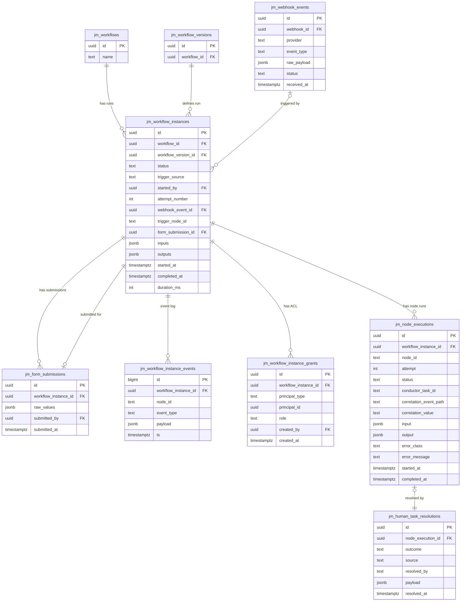
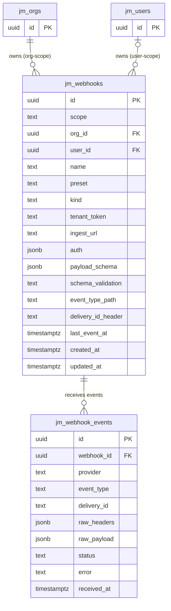
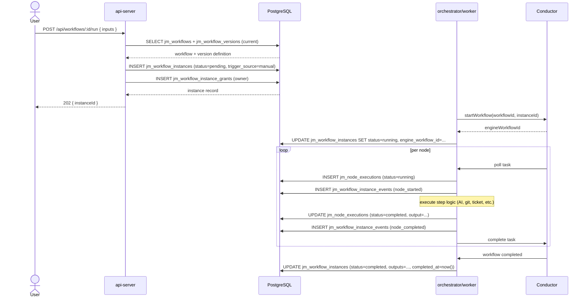
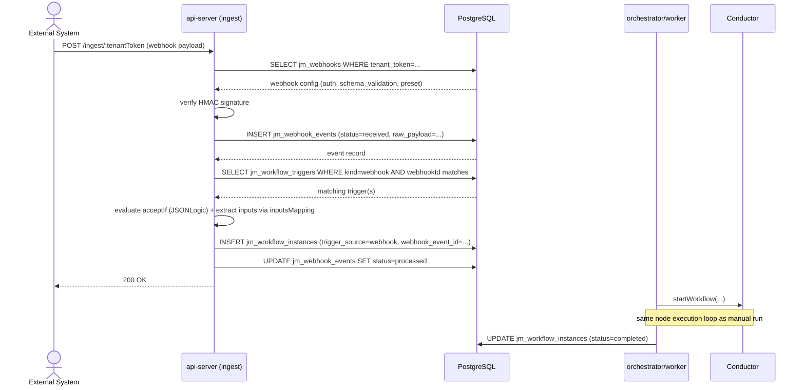
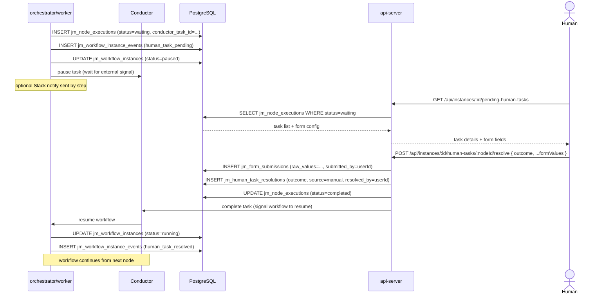
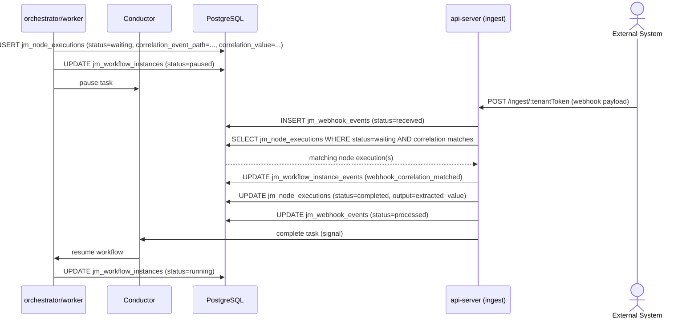
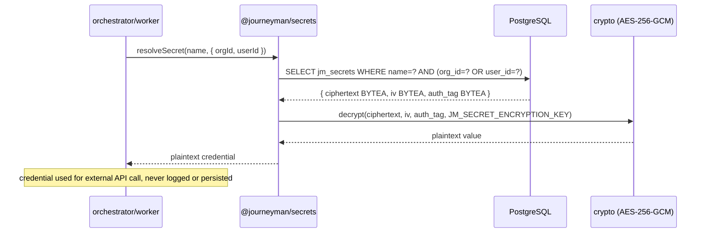

# DATABASE_ARCHITECTURE.md — Schema, Diagrams & Patterns

Linked from [AGENTS.md](../../AGENTS.md). Covers PostgreSQL schema design, entity relationships, key interaction sequences, and recurring patterns every contributor must understand.

---

## Overview

| Property | Value |
|---|---|
| **Engine** | PostgreSQL 16 (Alpine) |
| **Access** | Direct SQL via `node-postgres` (`pg`) — no ORM |
| **Host port (dev)** | 5433 |
| **Connection** | `DATABASE_URL` environment variable |
| **Schema versioning** | Append-only numbered migrations in `packages/migrations/` |
| **Encryption** | AES-256-GCM applied in the application layer (`packages/secrets`) |

All 32 migrations are idempotent, numbered sequentially, and tracked in `jm_schema_migrations`. Once merged to `master`, a migration is **permanent** — roll forward with a new migration, never backwards.

---

## Table Catalog

### Identity & Tenancy

| Table | Purpose |
|---|---|
| `jm_orgs` | Tenant organisations |
| `jm_users` | Platform user accounts |
| `jm_auth_identities` | Per-provider credentials (password hash, OAuth token, etc.) |
| `jm_memberships` | User ↔ org role assignments |
| `jm_refresh_tokens` | Short-lived session refresh tokens |
| `jm_api_tokens` | Long-lived programmatic API credentials |
| `jm_system_state` | Bootstrap marker (e.g. initial admin created) |

### Secrets

| Table | Purpose |
|---|---|
| `jm_secrets` | Org/user-scoped encrypted credentials. Stores `ciphertext`, `iv`, and `auth_tag` as `BYTEA`; decrypted only in `packages/secrets/src/crypto.ts`. |

### Workflow Definitions

| Table | Purpose |
|---|---|
| `jm_workflows` | Workflow metadata, status (`draft`/`ready`), scope (`user`/`org`/`global`) |
| `jm_workflow_versions` | Immutable snapshots of a workflow graph (nodes, edges, config) stored as JSONB |
| `jm_workflow_grants` | Principal-based ACL for a workflow (`user`/`org`/`global` × `owner`/`editor`/`viewer`) |
| `jm_workflow_triggers` | Index of active trigger nodes (kind: `manual`/`webhook`/`human`) per workflow version |

### Workflow Execution

| Table | Purpose |
|---|---|
| `jm_workflow_instances` | Each run of a workflow; holds definition snapshot, status, inputs/outputs |
| `jm_workflow_instance_events` | Append-only event log per instance (BIGSERIAL for strict ordering) |
| `jm_workflow_instance_grants` | Per-run ACL mirroring workflow grant shape |
| `jm_node_executions` | Per-node execution record including retry attempt, I/O, Conductor task ID, and webhook-wait correlation data |
| `jm_human_task_resolutions` | Resolution audit: outcome, source (`manual`/`timeout`), actor, payload |
| `jm_form_submissions` | Raw form values submitted for Human Task nodes |

### Webhooks

| Table | Purpose |
|---|---|
| `jm_webhooks` | Webhook endpoint configurations (preset, kind, HMAC auth, payload schema, schema validation mode) |
| `jm_webhook_events` | Inbound webhook payloads with processing status |

### Integrations

| Table | Purpose |
|---|---|
| `jm_mcp_instances` | MCP server configurations (stdio/http/sse transport, env-var bindings to secrets, system prompt) |
| `jm_skill_packages` | Git-based skill package registry (install status, enabled skills, CLI type) |
| `jm_custom_ai_steps` | User/org-defined AI step templates (prompt, input fields, output schema, tool/MCP/skill defaults) |
| `jm_coding_models` | Admin-managed AI model catalog (provider, model ID, capabilities, enabled/deprecated/default flags) |
| `jm_schema_migrations` | Applied migration log — do not edit manually |

---

## ER Diagram

> Rendered by any Mermaid-compatible viewer (GitHub, GitLab, VS Code with Mermaid extension).

### Cluster 1 — Identity & Tenancy



### Cluster 2 — Secrets, MCP & Skills (Scoped Resources)



### Cluster 3 — Workflow Definitions & Grants



### Cluster 4 — Workflow Execution



### Cluster 5 — Webhooks



---

## Sequence Diagrams

### 1 — Manual Workflow Run

A user triggers a workflow run via the API. The API gateway validates, creates the instance, and hands off to Conductor through the worker.



### 2 — Webhook-Triggered Workflow Run

An external system (GitHub, Jira, Linear, etc.) sends a webhook. The ingest endpoint verifies, stores the event, matches it to a workflow trigger, and starts a run.



### 3 — Human Task Pause & Resume

A workflow reaches a `human-task` node. The orchestrator pauses via Conductor, the API exposes the task for a human to resolve, and the resolution unblocks the workflow.



### 4 — Webhook-Wait Correlation

A workflow pauses at a `webhook-wait` node and resumes when a matching inbound webhook arrives and satisfies the correlation condition.



### 5 — Secret Retrieval During Step Execution

A step that needs an external credential reads from the secrets vault. Decryption happens entirely in the application layer.



---

## Key Design Patterns

### Scope Pattern (multi-tenancy)

All user/org-scoped resources share the same shape. A `UNIQUE NULLS NOT DISTINCT` constraint ensures uniqueness within a scope without special-casing nulls.

```sql
scope  TEXT NOT NULL CHECK (scope IN ('user', 'org'))
org_id UUID NOT NULL REFERENCES jm_orgs(id) ON DELETE CASCADE
user_id UUID            REFERENCES jm_users(id) ON DELETE CASCADE
-- user_id is NULL for org-scope rows, populated for user-scope
UNIQUE NULLS NOT DISTINCT (scope, org_id, user_id, name)
```

Tables using this pattern: `jm_secrets`, `jm_mcp_instances`, `jm_skill_packages`, `jm_custom_ai_steps`, `jm_webhooks`.

### Grant / ACL Pattern

Access control uses a `principal_type` + `principal_id` pair that avoids separate join tables per principal type.

```sql
principal_type TEXT NOT NULL CHECK (principal_type IN ('user', 'org', 'global'))
principal_id   UUID
-- Enforced by constraint: global → principal_id IS NULL; user/org → NOT NULL
CONSTRAINT principal_xor CHECK (
  (principal_type = 'global' AND principal_id IS NULL) OR
  (principal_type IN ('user', 'org') AND principal_id IS NOT NULL)
)
```

Tables using this pattern: `jm_workflow_grants`, `jm_workflow_instance_grants`.

### Immutable Event Log

`jm_workflow_instance_events` uses `BIGSERIAL` for guaranteed per-instance ordering and is never updated or deleted. Query it for audit, debugging, and live-status SSE streams.

### Encrypted Secret Storage

`jm_secrets` stores `ciphertext`, `iv`, and `auth_tag` as `BYTEA`. The encryption key (`JM_SECRET_ENCRYPTION_KEY`) never touches the database. Decryption occurs exclusively in `packages/secrets/src/crypto.ts`. Never log decrypted values.

### JSONB for Flexible Configuration

High-variability config is stored as JSONB rather than proliferating columns:

| Table | JSONB columns | Purpose |
|---|---|---|
| `jm_workflow_versions` | `definition` | Full workflow graph (nodes, edges, config) |
| `jm_workflow_instances` | `definition_snapshot`, `inputs`, `outputs` | Immutable run-time state |
| `jm_custom_ai_steps` | `input_fields`, `output_schema`, `default_mcp_ids`, `slots` | Step configuration |
| `jm_webhooks` | `auth`, `payload_schema` | Provider auth config + expected payload shape |
| `jm_mcp_instances` | `args`, `bindings` | Transport arguments + secret env-var bindings |
| `jm_node_executions` | `input`, `output` | Per-node I/O at run time |

---

## Migration Rules (summary)

Full rules in [DEPLOYMENT.md](DEPLOYMENT.md). Key constraints:

1. Migrations are **append-only** — never edit or delete an applied migration.
2. Ship the migration in the **same PR** as the code that depends on it.
3. No implicit multi-hour table locks. No `NOT NULL` on a populated column without a documented backfill strategy.
4. Destructive migrations (drop column / table) require explicit user approval and a documented rollback plan.
5. Use `UNIQUE NULLS NOT DISTINCT` for nullable composite-unique constraints (PostgreSQL 15+).
