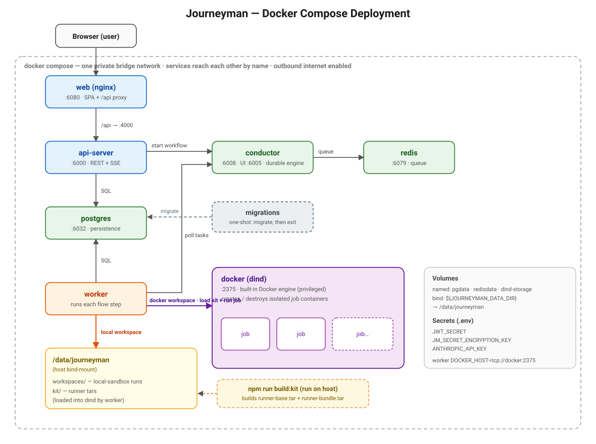

# Deploy Journeyman with Docker Compose

This guide brings the **whole** Journeyman stack up with one `docker compose` command:
UI, API, worker, the durable engine (Conductor + Redis + Postgres), and a built-in
Docker engine so AI coding jobs can run in isolated containers.

> **Status:** this describes the target setup defined in
> [docs/superpowers/specs/2026-06-08-docker-compose-deployment-design.md](superpowers/specs/2026-06-08-docker-compose-deployment-design.md).
> The compose/Dockerfile changes it depends on are tracked in that spec's implementation plan.

## Architecture



### Services

Host ports use a **6000 series** to avoid clashing with the dev infra stack
(`infra/compose.dev.yml`) and common local services. Only host-side ports change —
container ports stay standard, so all in-network URLs (`postgres:5432`, `api-server:4000`,
`conductor:8080`) are unchanged.

| Service | Image | Role | Host port | Container |
|---|---|---|---|---|
| `web` | nginx + built SPA | serves the UI, proxies `/api` → api-server | **6080** | 8080 |
| `api-server` | `journeyman/api-server` | Fastify REST + SSE gateway | **6000** | 4000 |
| `worker` | `journeyman/worker` | executes flow steps and AI coding jobs | — | — |
| `dockerproxy` | `alpine/socat` | bridges the host Docker socket to TCP for the worker | — (internal `2375`) | 2375 |
| `conductor` | orkes-conductor | durable workflow engine | **6008**, **6005** (UI) | 8080, 5000 |
| `postgres` | `postgres:16` | persistence | **6032** | 5432 |
| `redis` | `redis:7` | Conductor queue | **6079** | 6379 |
| `migrations` | `journeyman/migrations` | one-shot: applies DB migrations, then exits | — | — |

### How a step runs (the worker's two paths)

A flow step runs inside a **sandbox** the user picks in the app. There are two kinds and
**both are always available** — the deployment never forces one:

- **Local sandbox** — the worker clones the repo and runs the AI *in its own container*,
  writing to `/data/journeyman/workspaces/<runId>` (a host bind-mount, so it survives restarts).
- **Docker sandbox** — the worker asks the host's Docker daemon (reached via the
  `dockerproxy` socat sidecar at `tcp://dockerproxy:2375`) to spin up a fresh, isolated
  container per job, then destroy it. The container is a **sibling** on the host daemon, so
  `host.docker.internal` reaches host-local services (e.g. a local LM Studio/Ollama server)
  from inside it. The runner image (the "kit") is pulled by digest from the registry on first use.

---

## Prerequisites

- Docker + the `docker compose` plugin.
- This repo checked out.

## 1. Configure `.env.production`

Deploy uses its own env file (`.env.production`), separate from the dev `.env`, so
settings (DB URLs, secrets, registry target) stay per-environment. The bundled
registry runs on `localhost:5500` (same port as dev — 5500 avoids the macOS AirPlay
clash on 5000; don't run the dev and deploy stacks at the same time). Copy the
template and fill in the **required** values:

```bash
cp .env.production.example .env.production
```

| Variable | Required | Notes |
|---|---|---|
| `JWT_SECRET` | ✅ | `openssl rand -hex 32` |
| `JM_SECRET_ENCRYPTION_KEY` | ✅ | `openssl rand -hex 32` |
| `ANTHROPIC_API_KEY` | ✅ for AI steps | `sk-ant-…` (no `claude login` inside a container) |
| `JOURNEYMAN_BASE_DIR` | optional | host folder bind-mounted to `/data/journeyman` (workspaces + kit). Default: `./.journeyman-data` |
| `GITHUB_ACCESS_TOKEN` / `JM_GLOBAL_GITHUB_TOKEN` | optional | default git token if not set per-user |

Generate both secrets quickly:

```bash
printf 'JWT_SECRET=%s\nJM_SECRET_ENCRYPTION_KEY=%s\n' "$(openssl rand -hex 32)" "$(openssl rand -hex 32)" >> .env.production
```

`compose-up.sh` will **stop with a clear error** if `JWT_SECRET` or
`JM_SECRET_ENCRYPTION_KEY` is missing — it will not boot with blank secrets.

## 2. The runner kit (registry)

Runner images are **pushed to a container registry** and pulled by workers — no
more tar files. Set the target registry in `.env.production`:

- `JOURNEYMAN_REGISTRY` — e.g. `localhost:5500` (bundled), `ghcr.io/acme`,
  `registry.gitlab.com/acme/journeyman`.
- `JOURNEYMAN_REGISTRY_USERNAME` / `JOURNEYMAN_REGISTRY_TOKEN` — optional, for
  private registries.

`compose:up` runs the full publish flow for you: it builds + pushes the kit, runs
migrations, then records the pushed image **digests** in the `kit_images` table via
`register-kit`. Workers read that table and pull the exact digest.

- `runner-base` → the **default box** (docker sandboxes with no custom image).
- `runner-bundle` → grafted into **custom** sandbox images.

To roll a new kit: `npm run build:kit && npm run register-kit` (workers pick up the
new digest automatically — no redeploy).

**Local default (zero-config):** compose ships a bundled `registry:2` service. With
the default `JOURNEYMAN_REGISTRY=localhost:5500`, `compose:up` starts it, waits for
it, then pushes — nothing to set up. The registry is a standalone published service, so
`localhost:5500` resolves to it from the host (push) and from the host Docker daemon
(pull, when provisioning sandboxes). Its storage lives in the `registry-storage` volume.

**External registry:** point `JOURNEYMAN_REGISTRY` at GHCR/GitLab/ECR/Docker Hub and
set `JOURNEYMAN_REGISTRY_USERNAME` / `JOURNEYMAN_REGISTRY_TOKEN`. The bundled registry
service is simply ignored.

(Local-only sandboxes never use the kit.)

## 3. Bring the stack up

```bash
npm run compose:up      # build+push kit → migrate → register kit → build app images → up
```

This starts the bundled registry, builds + pushes the runner kit, runs migrations, records the
kit digests in `kit_images`, builds the four app images, then starts every service. `migrations`
runs first and exits; `api-server`/`web` wait until it has completed and the DB is healthy.

Check status and logs:

```bash
docker compose -f compose.deploy.yml ps
docker compose -f compose.deploy.yml logs -f worker
```

Open the UI: **http://localhost:6080**  (Conductor UI: http://localhost:6005)

## 4. Create a sandbox in the app

Log in, then go to **Sidebar → Sandboxes → New sandbox**.

**Local workspace** (simplest):
1. Type = **Local** → Save.

**Docker workspace, built-in engine:**
1. Type = **Docker**
2. Daemon host = `tcp://dockerproxy:2375` (the socat proxy to the host Docker daemon).
3. Image source = a prebuilt ref (e.g. `node:22-bookworm`) or a Dockerfile.
4. Network = **Full (internet)**.
5. Save → **Test connection** → ✅.

**Docker workspace, your own engine (any IP):**
1. Type = **Docker**
2. Daemon host = `tcp://<your-host>:2376`.
3. Save → **Test connection** → ✅.

The worker connects straight to whatever host you set. A Docker sandbox always needs an explicit
daemon host — there is no local-socket option or fallback.

**Local development (host-run worker).** When you run the worker on your host with
`npm run start:worker` (deps from `infra/compose.dev.yml`), the dev stack publishes a
`dockerproxy` on `127.0.0.1:2375`. Set the sandbox's Daemon host to `tcp://localhost:2375`.
Sandboxes still run as siblings on your host Docker daemon, so `host.docker.internal`
reaches host-local model servers (use Base URL `http://host.docker.internal:1234/v1`).

---

## Operations

```bash
npm run compose:down     # stop the stack (keep everything)
npm run compose:reset    # stop + remove named volumes (registry); DB data is PRESERVED
npm run compose:wipe-db  # DESTRUCTIVE: stop + delete the host postgres/redis folders
docker compose -f compose.deploy.yml logs -f api-server
```

### Data durability

Postgres and redis store their data in **host bind-mounts** under `JOURNEYMAN_BASE_DIR`
(`$JOURNEYMAN_BASE_DIR/postgres`, `$JOURNEYMAN_BASE_DIR/redis`). Bind-mounts are never
removed by `docker compose down -v`, so DB data survives `compose:down`/`compose:reset` and
even a raw `down -v`. The **only** command that deletes it is `compose:wipe-db`.

**Existing deployment → host folders (one-time migration).** If your data is still in the old
`journeyman-deploy_pgdata` / `journeyman-deploy_redisdata` named volumes, copy it across once
(stack down):
```bash
docker compose -f compose.deploy.yml down    # keep the named volumes (no -v)
npm run migrate-db-to-host                    # cp the volume contents into the host folders
npm run compose:up
```
Fresh deployments need no migration — `compose:up` creates the folders and postgres
initializes normally.

## Troubleshooting

| Symptom | Likely cause | Fix |
|---|---|---|
| `compose-up` aborts naming `JWT_SECRET` | secrets not set | add them to `.env.production` (step 1) |
| Docker-sandbox "Test connection" fails | dockerproxy not up, or kit missing | check `docker compose -f compose.deploy.yml ps` shows `dockerproxy`; if the kit is stale, `rm -rf .journeyman-data/kit && npm run compose:up` rebuilds it |
| Sandbox can't reach a host-local model | wrong address from a sibling container | use `http://host.docker.internal:1234/v1` (not `localhost`); confirm with `docker run --rm curlimages/curl -s http://host.docker.internal:1234/v1/models` |
| AI step errors with auth | `ANTHROPIC_API_KEY` missing | set it in `.env.production`, `docker compose -f compose.deploy.yml up -d worker` |
| `web` loads but `/api` calls fail | api-server not healthy yet | `docker compose -f compose.deploy.yml logs api-server` |
| Local-sandbox clone fails with `git: not found` | worker image missing git | rebuild images (`npm run images:build`) |

## Security notes

- The `dockerproxy` (socat) service exposes the host's **full, unauthenticated Docker API**
  over plain TCP — **root-equivalent on the host** for anything that can reach it. It is
  bound to the **private compose network only and never published**. Acceptable for a
  self-hosted single-host deployment; do not expose that port beyond the host.
- Sandboxes run as **siblings** on the host Docker daemon (not nested), so they share the
  host's images/volumes. For stronger isolation in untrusted/multi-tenant setups, point the
  sandbox's daemon host at a dedicated/remote daemon (TLS certs via the connection config).
