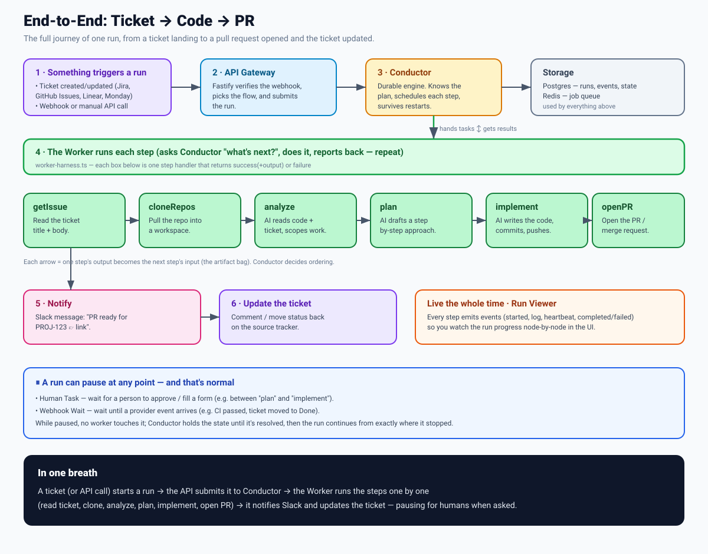
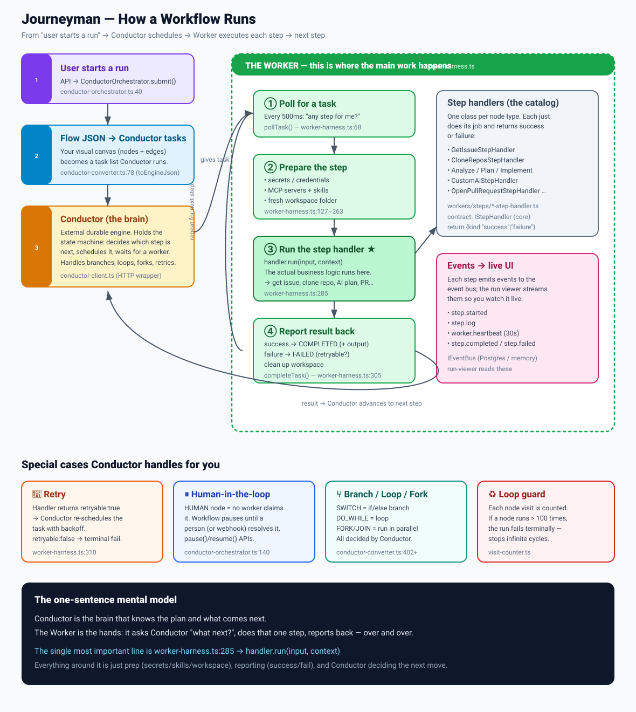
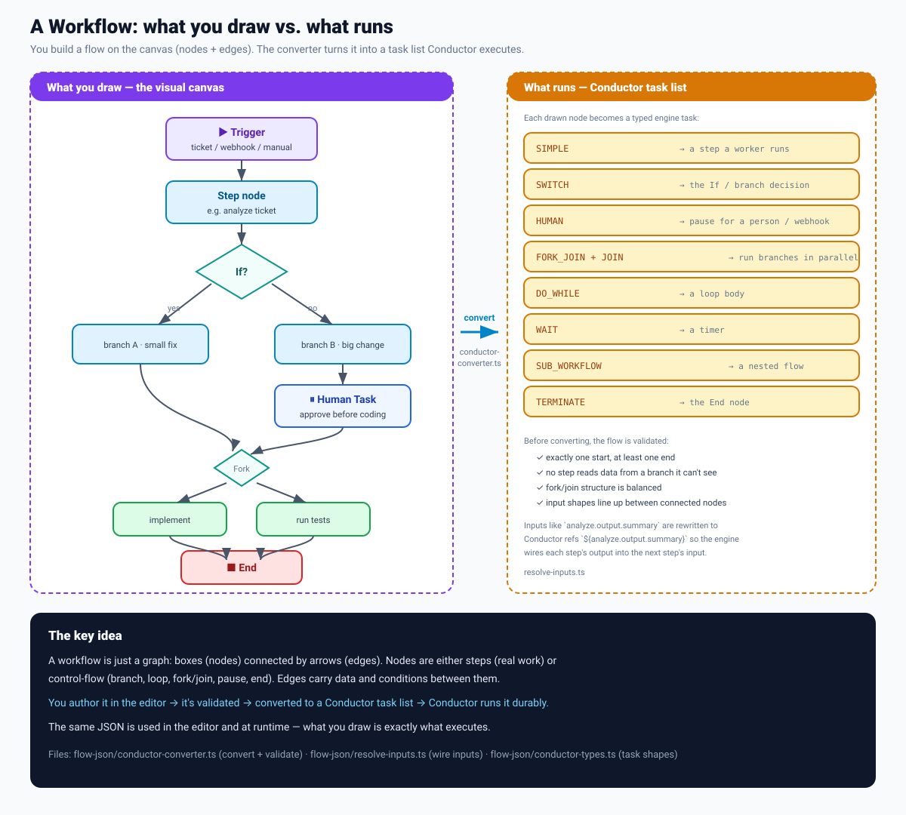

# How It Works

A plain-English tour of what happens when Journeyman runs a flow — from a ticket landing to a pull request opened. Three diagrams, each zooming in one level deeper.

If you remember one thing: **Conductor is the brain that knows the plan; the Worker is the hands that does each step.** Everything below is detail around that.

---

## 1. End-to-end: ticket → code → PR

The whole journey of a single run.

1. **Something triggers a run** — a ticket is created/updated (Jira, GitHub Issues, Linear, Monday), a provider webhook fires, or someone calls the API directly.
2. **The API Gateway** verifies the request, picks the flow to run, and submits it.
3. **Conductor** (a durable orchestration engine) takes the flow's plan and starts scheduling steps. It remembers everything, so a crash doesn't lose the run.
4. **The Worker runs each step** — read the ticket, clone the repo, analyze, plan, implement, open the PR. Each step's output feeds the next.
5. **Notify** — a Slack message goes out (e.g. "PR ready 👉 link").
6. **Update the ticket** — a comment or status change on the source tracker.

Throughout, every step emits events, so you watch the run progress node-by-node in the **Run Viewer**. A run can also **pause** at any point for a human approval or to wait for another webhook — and resume from exactly where it stopped.

---

## 2. The Worker — where the main work happens

Zooming into step 4 above. This is the core loop and the single most important piece of code to understand.

Think of a **restaurant kitchen**:

- **Conductor = the head chef / order board.** It knows the whole recipe (your flow), what comes next, and posts "tickets" for work. It's a separate durable engine.
- **The Worker = the line cook.** It doesn't know the recipe. It keeps asking *"any ticket for me?"*, cooks that one dish, hands it back, and asks again.

The worker loop, in [`worker-harness.ts`](../packages/orchestrator/src/workers/worker-harness.ts):

| # | What | Where |
|---|------|-------|
| ① | **Poll** Conductor every 500ms: "got a step for me?" | `processOnce()` |
| ② | **Prepare** the step — load secrets, MCP servers, skills; make a fresh workspace folder | |
| ③ | **Run it** → `handler.run(input, context)` ← ⭐ the line that does the actual work | `:285` |
| ④ | **Report** back — success (+output) or failure; clean up the workspace | `completeTask()` |

Then it loops back to ① for the next step. Conductor uses the result to decide what comes next.

### Where the actual step work lives

Step ③ calls a **step handler** — one small class per node type, in [`packages/orchestrator/src/workers/steps/`](../packages/orchestrator/src/workers/steps/). Each does its job and returns `{ kind: "success", output }` or `{ kind: "failure", failure }`. Examples:

- `GetIssueStepHandler` — fetch a Jira/GitHub ticket
- `CloneReposStepHandler` — clone the repo
- analyze / plan / implement — the AI coding steps
- `CustomAiStepHandler` — user-defined AI prompt steps
- `OpenPullRequestStepHandler` — open the PR / MR

They all obey one contract: `IStepHandler` (defined in `@journeyman/core`).

### The clever bits Conductor handles for you

| | Behaviour |
|---|---|
| 🔁 **Retry** | A handler returning `retryable: true` makes Conductor re-schedule the task with backoff. `retryable: false` fails it terminally. |
| ⏸ **Human-in-the-loop** | A `HUMAN` node is never claimed by a worker — the workflow pauses until a person (or webhook) resolves it, then continues. |
| ⑂ **Branch / loop / parallel** | `SWITCH` (if/else), `DO_WHILE` (loop), and `FORK`/`JOIN` (parallel) are all decided by Conductor. |
| ♻ **Loop guard** | Every node visit is counted; if a node runs more than 100 times the run fails, so infinite cycles can't run forever. |
| 📡 **Live UI** | Each step emits events (`step.started`, `step.log`, `worker.heartbeat`, `step.completed` / `step.failed`) to an event bus the Run Viewer streams. |

---

## 3. The workflow itself — what you draw vs. what runs

You never write Conductor task definitions by hand. You draw a flow on the canvas; Journeyman converts it.

A workflow is just a **graph**: boxes (nodes) connected by arrows (edges).

- **Nodes** are either **steps** (real work) or **control-flow** (branch, loop, fork/join, pause, end).
- **Edges** carry data and conditions between nodes.

When a flow is published or run, [`conductor-converter.ts`](../packages/orchestrator/src/flow-json/conductor-converter.ts) **validates** it (exactly one start, at least one end, balanced fork/join, compatible input shapes, no reaching across branches it can't see) and **converts** each node into a typed Conductor task:

| You drew | Becomes |
|---|---|
| Step node | `SIMPLE` — a step a worker runs |
| If / XOR gateway | `SWITCH` |
| Human Task / Webhook Wait | `HUMAN` |
| Fork + Join | `FORK_JOIN` + `JOIN` |
| Loop | `DO_WHILE` |
| Timer | `WAIT` |
| Subflow | `SUB_WORKFLOW` |
| End | `TERMINATE` |

Input references you wire in the editor (like `analyze.output.summary`) are rewritten to Conductor template refs (`${analyze.output.summary}`) by [`resolve-inputs.ts`](../packages/orchestrator/src/flow-json/resolve-inputs.ts), so the engine feeds each step's output into the next step's input.

**The same JSON is used in the editor and at runtime — what you draw is exactly what executes.**

---

## Where to go next

- [Flows](flows.md) — author flows in the visual editor or YAML
- [Parallel & Pauses](parallel-and-pauses.md) — Human Task, Webhook Wait, Fork, and Join modes
- [Steps](steps.md) — the built-in step catalog and the `IStepHandler` interface
- [Artifacts](artifacts.md) — how data flows between steps
- [Architecture](constitution/ARCHITECTURE.md) — system and package layout

## Key files

| File | Role |
|---|---|
| [`orchestrator/src/workers/worker-harness.ts`](../packages/orchestrator/src/workers/worker-harness.ts) | The worker loop — poll, prepare, run, report |
| [`orchestrator/src/cli-worker.ts`](../packages/orchestrator/src/cli-worker.ts) | Worker entry point — registers handlers and starts the loop |
| [`orchestrator/src/workers/steps/`](../packages/orchestrator/src/workers/steps/) | One handler per step type (the actual work) |
| [`orchestrator/src/engines/conductor/conductor-orchestrator.ts`](../packages/orchestrator/src/engines/conductor/conductor-orchestrator.ts) | Submit / pause / resume / retry a run |
| [`orchestrator/src/engines/conductor/conductor-client.ts`](../packages/orchestrator/src/engines/conductor/conductor-client.ts) | HTTP wrapper over Conductor's REST API |
| [`orchestrator/src/flow-json/conductor-converter.ts`](../packages/orchestrator/src/flow-json/conductor-converter.ts) | Validate + convert a flow graph into Conductor tasks |
| [`orchestrator/src/flow-json/resolve-inputs.ts`](../packages/orchestrator/src/flow-json/resolve-inputs.ts) | Wire each step's output into the next step's input |
